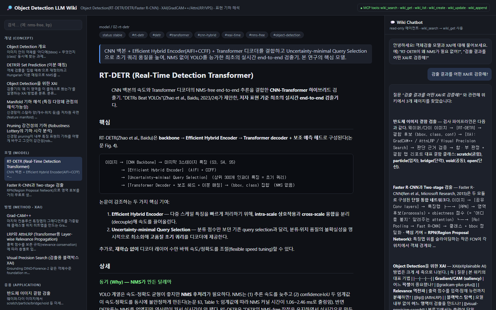

# Object Detection LLM Wiki — MCP 기반 Wiki Tool

> 제출물 ④(README): 프로젝트 개요 + 어떤 **MCP Tool 기능**을 어떻게 쓰는지 + 실행 방법(환경·의존성).

객체검출(Object Detection)과 XAI(설명가능 AI) 연구 지식을
담은 **markdown LLM Wiki** 를, **MCP(Model Context Protocol) 서버**로 노출해 AI 에이전트가 질의·갱신하고,
사람은 **웹 GUI** 로 시각화·검색·질의하는 도구.



> **ℹ️ 참고 문헌 원문 PDF는 저작권·용량 문제로 이 저장소에 포함하지 않습니다.** 각 위키 페이지 하단 "참고/출처"에 서지정보와 arXiv/DOI를 인용했습니다(`.gitignore`로 제외).

---

## 0. Quick Start (사용 방법 요약)

```powershell
# 1) 의존성 설치 (Windows: python 별칭이 깨졌으면 py 런처 사용)
py -m pip install -r requirements.txt

# 2-A) 웹 GUI(MVP) 실행 — 사람이 보는 화면
py server/app.py
#   → 브라우저에서 http://127.0.0.1:5000 접속 (검색·페이지 뷰·챗봇)

# 2-B) MCP 서버 실행 — AI 에이전트(Claude Desktop/Code 등)가 붙는 대상
py server/mcp_server.py            # stdio (MCP 클라이언트가 자식 프로세스로 구동)
py server/mcp_server.py --http     # HTTP: http://127.0.0.1:8000/mcp

# 3) 동작 점검(스모크 테스트) — LLM/네트워크 불필요
py server/wiki_core.py             # 통계 + 'rt-detr xai' 검색 결과 출력
```

- **사람**: `app.py`(Flask) → 사이드바에서 페이지 열람, 상단 검색, 우측 챗봇(읽기 전용 retrieval) 질의.
- **AI 에이전트**: `mcp_server.py`가 6개 MCP 툴(`wiki_search/get/list` = 읽기, `wiki_create/update/append` = 쓰기)을 노출. 자세한 연결 예시는 [6.5절](#65-mcp-클라이언트-연결-예-claude-desktop-mcpservers).
- 두 진입점은 같은 `server/wiki_core.py`를 공유하므로 **에이전트가 쓰면 GUI에도 즉시 반영**됩니다.

상세 환경·설치·MCP 클라이언트 설정은 [6절](#6-실행-방법-환경--의존성)을 참고하세요.

---

## 1. What · Why · How

- **What**: 객체검출 연구 지식의 단일 출처(markdown + YAML front-matter). 페이지 11 + 용어 3.
- **Why**: 모델·XAI 해석 노하우가 빠르게 늘어 **검색·갱신 가능한** 구조가 필요. LLM 에이전트가
  표준 방식(MCP)으로 읽고 쓰게 하면, 사람과 에이전트가 같은 지식 베이스를 공유한다.
- **How**: `wiki_core`(도메인 로직)를 `mcp_server`(에이전트용)와 `app`(사람용 GUI)이 **공유** →
  단일 진실 출처(single source of truth). 쓰기는 스키마 검증 + 저널 기록으로 무결성 보장.

## 2. 디렉토리 구조

```
WikiTool_MCP/
├── README.md                    ← (이 파일) 제출물 ④
├── requirements.txt             ← 의존성
├── docs/
│   ├── 01_knowledge_domain.md   ← 제출물 ① 지식 도메인 정의
│   ├── 02_decision_journal.md   ← 제출물 ② 의사결정 저널(Journal 패턴 적용)
│   ├── 03_PRD_spec.md           ← 제출물 ③ PRD/사양
│   └── 04_agent_spec.md         ← 에이전트 역할·권한·허용기능 SPEC
├── server/
│   ├── wiki_core.py             ← 전송계층 독립 도메인 로직(검색/CRUD/저널)
│   ├── mcp_server.py            ← FastMCP 서버 (Tool ↔ AI Agent 다리)
│   └── app.py                   ← Flask 웹 GUI (뷰어 + 검색 + 챗봇)
├── wiki/                        ← 위키 콘텐츠(markdown)
│   ├── AGENTS.md · SCHEMA.md · llms.txt
│   ├── pages/01~11*.md · glossary/{iou,map,nms}.md
│   └── _meta/{source_index,journal}.md
└── mvp/                         ← MVP 스크린샷(PNG) + PDF
```

## 3. MCP Tool — 무엇을, 왜, 어떻게

**MCP 서버가 곧 "Tool 과 AI Agent 를 잇는 다리"** 다. 에이전트는 MCP 프로토콜의 `tools/list`·`tools/call`
로 아래 6개 툴을 표준 방식으로 호출한다. 실제 파일 I/O 는 `wiki_core` 가 담당(전송 ↔ 로직 분리).

| 툴 | 기능 | 권한 | 동작 방식 |
|---|---|:---:|---|
| `wiki_search(query, limit)` | 가중치 키워드 검색 | read | 제목5/슬러그4/요약3/태그3/본문1 점수 합산 후 상위 반환 |
| `wiki_get(slug)` | 페이지 전체 조회 | read | 숫자prefix·alias·glossary 자동 해석 후 front-matter+본문 반환 |
| `wiki_list(category, kind)` | 목록/필터 | read | 카테고리/종류 필터링한 요약 목록 |
| `wiki_create(slug,title,summary,body,…)` | 새 페이지 | write | SCHEMA 필수필드·slug 규칙·중복 검증 → 파일 생성 → 저널 |
| `wiki_update(slug,…)` | 부분 갱신 | write | 지정 필드만 덮어쓰고 `updated` 자동 갱신 → 저널 |
| `wiki_append(slug,text,heading)` | 본문 추가 | write | 말미(또는 `## heading`)에 추가 → 저널 |

리소스: `wiki://stats`(페이지 통계). **삭제 툴은 의도적으로 없음**(지식 손실·권한 위험 방지).

> 왜 도메인 특화 툴인가: 범용 `read_file/write_file` 은 스키마 검증·저널을 우회해 위키 무결성을 깬다.
> 위 6개 툴은 가드레일(필수필드·slug·중복·updated·저널)을 **강제**한다. (근거: `docs/02_decision_journal.md` Round 4·6)

## 4. 에이전트 (편집 / 챗봇)

- **Chatbot Agent (read-only)**: `wiki_search`→`wiki_get` 으로 근거를 찾아 답하고 출처를 링크. 쓰기 금지.
- **Editor Agent (read-write)**: 위 + `create/update/append` 로 위키 확장. 모든 변경은 저널에 기록.
- 상세 역할·권한·System Prompt·금지사항은 **`docs/04_agent_spec.md`** 참조.

## 5. 페이지 시각화 & 사용자 기능 (GUI)

`app.py`(Flask)가 제공:
- **사이드바**: 카테고리(개념/모델/방법/응용) + Glossary 로 그룹화된 페이지 목록.
- **본문 렌더**: markdown→HTML, `[[위키링크]]`·`(slug.md)` 를 내부 링크로 해석, front-matter 칩 표시.
- **검색**: 상단 검색창 → `wiki_search` 결과를 사이드바에 표시.
- **Wiki Chatbot 패널**: 자연어 질문 → 관련 페이지 요약 + 출처 칩(읽기 전용 에이전트 시연).

## 6. 실행 방법 (환경 · 의존성)

### 6.1 환경
- **OS**: Windows (PowerShell). Python 3.13 기준 검증. (`python` 별칭이 깨진 환경에선 `py` 런처 사용)
- **Python**: 3.10+ 권장.

### 6.2 설치
```powershell
cd WikiTool_MCP
py -m pip install -r requirements.txt
```

### 6.3 웹 GUI(MVP) 실행
```powershell
py server/app.py
# 브라우저에서 http://127.0.0.1:5000  접속
# (스크린샷용 데모: http://127.0.0.1:5000/demo/02-rt-detr )
```

### 6.4 MCP 서버 실행
```powershell
# (A) stdio: MCP 클라이언트가 자식 프로세스로 구동 (Claude Desktop/Code 등)
py server/mcp_server.py

# (B) HTTP: 원격/별도 프로세스에서 접속
py server/mcp_server.py --http     # http://127.0.0.1:8000/mcp
```

### 6.5 MCP 클라이언트 연결 예 (Claude Desktop `mcpServers`)
```json
{
  "mcpServers": {
    "objdet-wiki": {
      "command": "py",
      "args": ["C:\\path\\to\\WikiTool_MCP\\server\\mcp_server.py"],
      "env": { "WIKI_ROOT": "C:\\path\\to\\WikiTool_MCP\\wiki" }
    }
  }
}
```
> chatbot 전용 세션은 클라이언트 설정에서 read 3툴만 등록해 권한을 강제(`docs/04_agent_spec.md`).

### 6.6 동작 점검(스모크 테스트)
```powershell
py server/wiki_core.py        # 통계 + 'rt-detr xai' 검색 결과 출력
```

## 7. LLM 백엔드 연결 지점(확장)

GUI 챗봇은 기본적으로 키 없이 동작하는 **retrieval** 방식이다(`app.py: chat_answer`).
실제 LLM 으로 답변을 생성하려면, `chat_answer` 에서 검색된 페이지를 컨텍스트로 LLM API(또는 MCP 클라이언트)에
넘기면 된다. **툴 화이트리스트(read 전용)** 는 그대로 유지한다.

## 8. 제출물 매핑

| # | 제출물 | 파일 |
|---|---|---|
| ① | 지식 도메인 정의 | `docs/01_knowledge_domain.md` |
| ② | 의사결정 저널 | `docs/02_decision_journal.md` (+ 런타임 `wiki/_meta/journal.md`) |
| ③ | PRD/사양 | `docs/03_PRD_spec.md` |
| ④ | README | `README.md` (이 파일) |
| ⑤ | MVP 이미지 | `mvp/mvp_screenshot.png`, `mvp/mvp_home.png`, `mvp/mvp_screenshot.pdf` |
| (보강) | 에이전트 SPEC | `docs/04_agent_spec.md` |
